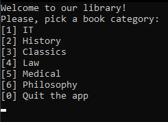
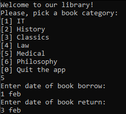
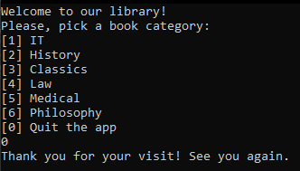
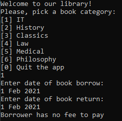
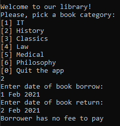
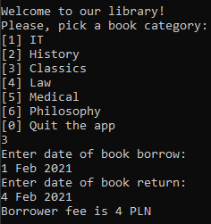
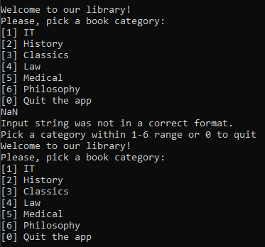
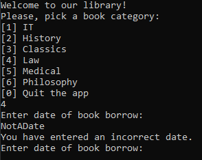
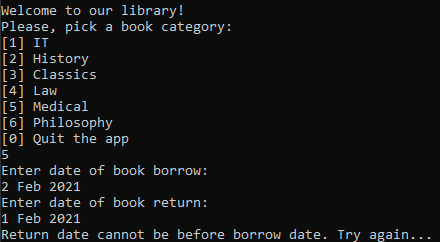
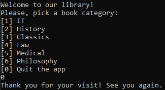

# Devideal Internship Task

.NET Console Application simulating simple library.  
Created by **Samuel Jędrzejewski**  
*samijedrzejewski@gmail.com*

## Assignment

We need a library app to keep track of books and penalty fees borrowers pay (per session, so we don't need to store them in any db/file etc).

### Library has the following policy:

- All books should be returned the next day.
- For IT Books borrower should pay a penalty of 5 PLN for next each day (so if book return due date was 01-Jan and borrower returned it at 03-Jan, then s/he should pay 10 PLN).
- For History Books borrower should pay a penalty of 3 PLN.
- For classics, law, medical, philosophy books the penalty is 2 PLN.

### Application should work in the following way:

- Please pick a book category [1] IT, [2] History, [3] etc.
- Please write the day, month, year of the borrow.
- Please write the day, month, year of the return.
- `borrower penalty fee is ...` OR `borrower has no fee to pay`.

## Description

I created a new project in _Visual Studio_ with _.NET Core 3.1_.



### Application structure

The application is just a `while` loop until the user inputs `0`.

```cs
bool working = true;

while (working) { ... }
```

Welcome message and options are logged onto the console.

```cs
Console.WriteLine("Welcome to our library!");
Console.WriteLine("Please, pick a book category:");
Console.WriteLine("[1] IT");
Console.WriteLine("[2] History");
Console.WriteLine("[3] Classics");
Console.WriteLine("[4] Law");
Console.WriteLine("[5] Medical");
Console.WriteLine("[6] Philosophy");
Console.WriteLine("[0] Quit the app");
```

### User input

I used `Console.ReadLine()` function to read the input of the user.  
For integer value I used `Convert.ToInt32()` function and for date - `DateTime.TryParse()`.



What is more I created a `DateInput()` function to handle incorrect user input.

```cs
static DateTime DateInput(string type) {
    DateTime date;

    Console.WriteLine("Enter date of book {0}:", type);

    if (DateTime.TryParse(Console.ReadLine(), out date)) return date;

    Console.WriteLine("You have entered an incorrect date.");

    return DateInput(type);
}
```

If the input is correct I return the date otherwise I recurisvely ask for the valid date.

### Return delay fees

I created a function to calculate money fees depending on delay in returning of the book.

```cs
static int CalculatePrice(int category, DateTime borrowDate, DateTime returnDate) {
    int fine = 0;

    switch (category) {
        case 1:
            fine = 5;
            break;
        case 2:
            fine = 3;
            break;
        case 3:
        case 4:
        case 5:
        case 6:
            fine = 2;
            break;
    }

    try {
        if (returnDate.CompareTo(borrowDate) < 0) {
            throw new InvalidOperationException("Return date cannot be before borrow date. Try again...");
        }
    } catch(InvalidOperationException e) {
        Console.WriteLine(e.Message);

        return -1;
    }

    int days = (int)returnDate.Subtract(borrowDate).TotalDays;

    return fine * (days > 1 ? days - 1 : 0);
}
```

I am checking if user put correct information about the dates so the return date is always after (or the same day as) the borrow date. If not I am thrownig an `InvalidOperationException` and return `-1` from the funciton to handle repeat of the process. If the dates are valid, I substract the dates and take `TotalDays` property of `DateTime` object. Fine is calculated as category value multiplied by a number of days after the day after borrowing day so it is 0 when book is returned the same day or the following day.

### Application logic

The application is based on the main `switch` so input is validated by it and appropriate action is taken.

```cs
try {
    category = Convert.ToInt32(Console.ReadLine());
} catch (FormatException e) {
    Console.WriteLine(e.Message);
} finally {
    switch (category) {
        case 1:
        case 2:
        case 3:
        case 4:
        case 5:
        case 6:
            DateTime borrowDate = DateInput("borrow");
            DateTime returnDate = DateInput("return");
            int price = CalculatePrice(category, borrowDate, returnDate);

            if (price == -1) break;

            Console.WriteLine((price == 0 ? "Borrower has no fee to pay" : "Borrower fee is " + price + " PLN") + "\n");

            break;
        case 0:
            working = false;
            break;
        default:
            Console.WriteLine("Pick a category within 1-6 range or 0 to quit");
            break;
    }
}
```

I am once again checking if the user inputs the value that can be converted to `int` and then asking for two valid dates.  
If dates were in inverted order, `price` will be equal `-1` and whole process will be repeated.
Puting `0` will end the programme causing farewell messsage to appear.



## Result examples

### 1. Book returned in the same day



```
input:
1
1 Feb 2021
1 Feb 2021
```

```
output:
Borrower has no fee to pay
```

### 2. Book returned the next day



```
input:
2
1 Feb 2021
2 Feb 2021
```

```
output:
Borrower has no fee to pay
```

### 3. Book returned 2 days after the deadline



```
input:
3
1 Feb 2021
4 Feb 2021
```

```
output:
Borrower fee is 4 PLN
```

### 4. Invalid integer input



```
input:
NaN
```

```
output:
Input string was not in a correct format.
```

### 5. Invalid date input



```
input:
4
NotADate
```

```
output:
You have entered an incorrect date.
```

### 6. Return date before borrow date



```
input:
4
2 Feb 2021
1 Feb 2021
```

```
output:
Return date cannot be before borrow date. Try again...
```

### 7. Quiting the app



```
input:
0
```

```
output:
Thank you for your visit! See you again.
```
